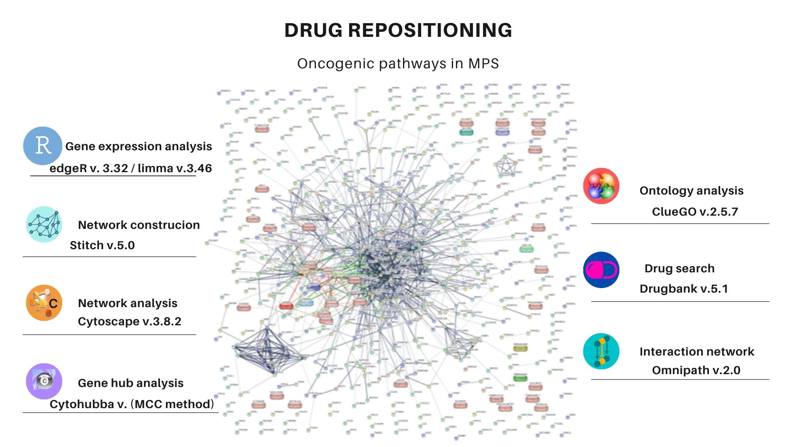

# oncogenic-pathways-and-MPS
## A systems biology work to discover drugs in common both in cancer and MPS diseases

We use the requests python library to acess the data of several drug databases, like:
* CTD <http://ctdbase.org/>
* PanDrugs <https://www.pandrugs.org/#!/>
* GDSC <https://www.cancerrxgene.org/> 
* DrugBank <https://go.drugbank.com/>
* PharmacoDB <https://pharmacodb.pmgenomics.ca/>

We use the gene2drug package available at <https://academic.oup.com/bioinformatics/article/34/9/1498/4721786> to compare our results with the available drugs-to-pathway in this tool.

We select several oncogenic pathways, according to our work available at <https://link.springer.com/chapter/10.1007%2F978-3-030-65775-8_24>

Cite this paper as:
Silva G.C.V., Soares L.D.F., Matte U. (2020) Oncogenic Signaling Pathways in Mucopolysaccharidoses. In: Setubal J.C., Silva W.M. (eds) Advances in Bioinformatics and Computational Biology. BSB 2020. Lecture Notes in Computer Science, vol 12558. Springer, Cham. https://doi.org/10.1007/978-3-030-65775-8_24
